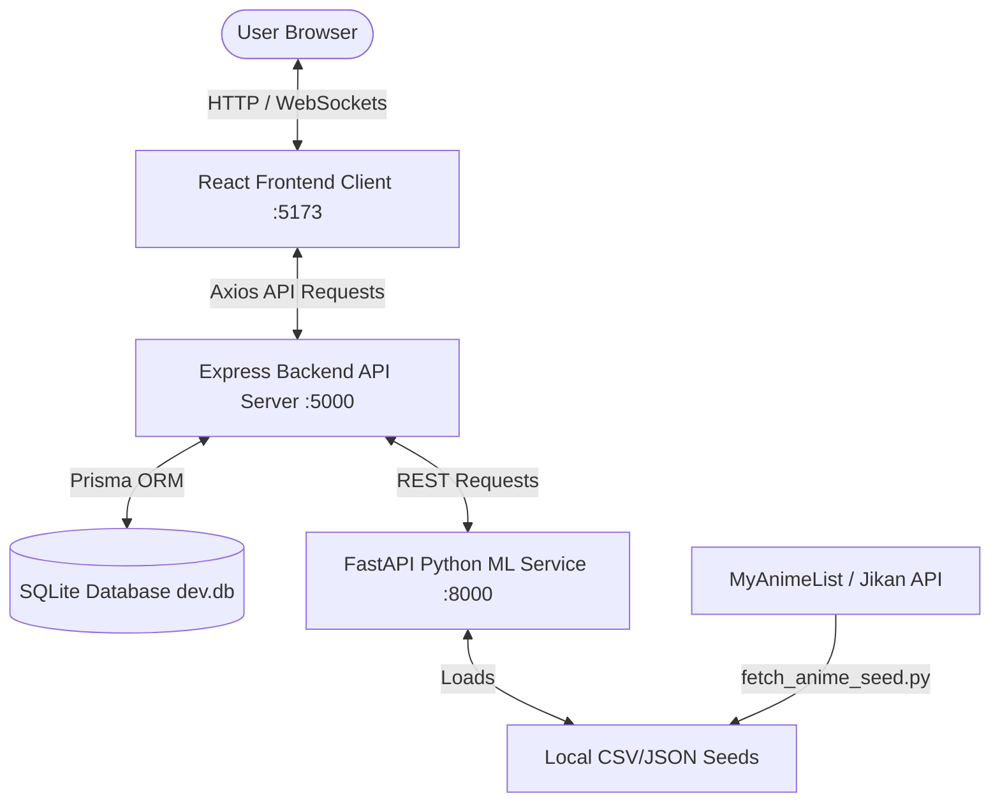

# NeoAnime: AI-Powered Anime Recommendation Engine

NeoAnime is a full-stack, state-of-the-art anime recommendation platform. It suggests highly relevant titles based on user preferences, ratings, and viewing habits using a combination of Content-Based Filtering (TF-IDF text similarity), Collaborative Filtering (Low-Rank SVD Matrix Factorization), and popularity coefficients. 

It also includes a semantic natural-language search engine and an intelligent AI chatbot assistant.

---

## System Architecture



---

## Recommendation Algorithms

The platform runs a **Weighted Hybrid Recommendation System** combining three scoring signals:

1. **Content-Based Score ($C$):** Builds a TF-IDF term-frequency matrix of each anime's combined *Genres, Synopsis, Studio,* and *Age Rating*. Pairwise similarity is calculated using Cosine Similarity.
2. **Collaborative Filtering Score ($CF$):** Pivots the user-item rating matrix, standardizes scores by subtracting user means, and decomposes the matrix using **Truncated SVD (Matrix Factorization)**. This reconstructs rating vectors to predict missing logs.
3. **Popularity Score ($P$):** Normalized average catalog scores.

### Hybrid Score Formula

$$\text{Final Score} = (0.4 \times C) + (0.4 \times CF) + (0.2 \times P)$$

---

## Directory Structure

```text
anime-recommender/
├── data/
│   ├── fetch_anime_seed.py      # Anime web crawler (MAL API)
│   ├── mock_ratings_generator.py # User ratings generator
│   ├── anime_seed.json          # Scraped anime catalog (500 titles)
│   └── mock_ratings.csv         # Generated rating records (5000+ logs)
├── backend/                     # Node.js Express Backend
│   ├── prisma/                  # Schema definition and SQLite configurations
│   ├── src/                     # Express controllers and JWT validation
│   └── tsconfig.json
├── ml-service/                  # FastAPI Python ML Service
│   ├── src/
│   │   ├── recommender.py       # TF-IDF, Cosine Sim, and SVD logics
│   │   ├── nlp_search.py        # Semantic Search with fallbacks
│   │   └── chatbot.py           # Conversational assistant router
│   ├── main.py                  # API endpoints definition
│   └── requirements.txt
├── frontend/                    # Vite React Client
│   ├── src/                     # React dashboard screens and chart components
│   ├── index.html
│   └── tailwind.config.js
└── docker-compose.yml           # Unified orchestration config
```

---

## Installation & Setup

Ensure you have **Node.js (v18+)**, **Python (3.10+)**, and **npm** installed on your system.

### Method 1: Docker Compose (Unified Execution)

From the root directory of the project, run:

```bash
docker-compose up --build
```
This builds and starts:
- Frontend on `http://localhost:5173`
- Express Backend on `http://localhost:5000`
- FastAPI ML Service on `http://localhost:8000`

---

### Method 2: Manual Local Execution (Step-by-Step)

#### Step 1: Initialize Datasets
Before starting, we need to crawl the seed catalog and generate mock rating matrix logs.
```bash
cd data
python fetch_anime_seed.py
python mock_ratings_generator.py
cd ..
```

#### Step 2: Spin up Express Backend
1. Install dependencies:
   ```bash
   cd backend
   npm install
   ```
2. Configure database files & run migrations:
   ```bash
   # Generates schema and local SQLite database dev.db
   npx prisma migrate dev --name init
   ```
3. Seed database:
   ```bash
   # Seeds anime details, 100 mock users, and 5000+ ratings
   npm run prisma:seed
   ```
4. Start development server:
   ```bash
   npm run dev
   ```
   The backend will start on `http://localhost:5000`.

#### Step 3: Run FastAPI ML Service
1. Create and activate a virtual environment:
   ```bash
   cd ml-service
   python -m venv venv
   # On Windows:
   .\venv\Scripts\activate
   # On Linux/macOS:
   source venv/bin/activate
   ```
2. Install dependencies:
   ```bash
   pip install -r requirements.txt
   ```
3. Start the FastAPI app:
   ```bash
   python main.py
   ```
   The service will boot on `http://localhost:8000`.

#### Step 4: Start React Frontend Client
1. Install dependencies:
   ```bash
   cd frontend
   npm install
   ```
2. Run development client:
   ```bash
   npm run dev
   ```
   The React client will launch on `http://localhost:5173`.

---

## API Documentation

### Express Backend Endpoints (`http://localhost:5000`)
- `POST /api/auth/signup`: User register (includes favorite genres onboarding array)
- `POST /api/auth/login`: User login, returns JWT token
- `GET /api/auth/profile`: Retrives logged-in user profile metrics
- `GET /api/anime`: Browse catalog with pagination, filters, and sorting parameters
- `GET /api/anime/:id`: Single anime information (returns user rating & status logs if logged in)
- `POST /api/anime/watchlist`: Log or rate anime status (Watching, Completed, Plan to watch, Dropped)
- `GET /api/recommendations/personal`: Serves personalized hybrid recommendation list (requires JWT)
- `GET /api/recommendations/similar/:id`: Return similar titles
- `POST /api/recommendations/chat`: Interact with AI Chatbot
- `POST /api/recommendations/search`: Execute natural language semantic AI query searches
- `GET /api/analytics`: Computes stats for pie, bar, and radar charts

### FastAPI ML Endpoints (`http://localhost:8000`)
- `POST /recommend/hybrid`: Computes weighted hybrid scoring matrices
- `GET /recommend/similar`: Returns content similarity rankings
- `POST /search/semantic`: Executes semantic vector cosine search matches
- `POST /chat`: AI chatbot message response parses
- `POST /train`: Reloads data files and retrains recommendation vectors
